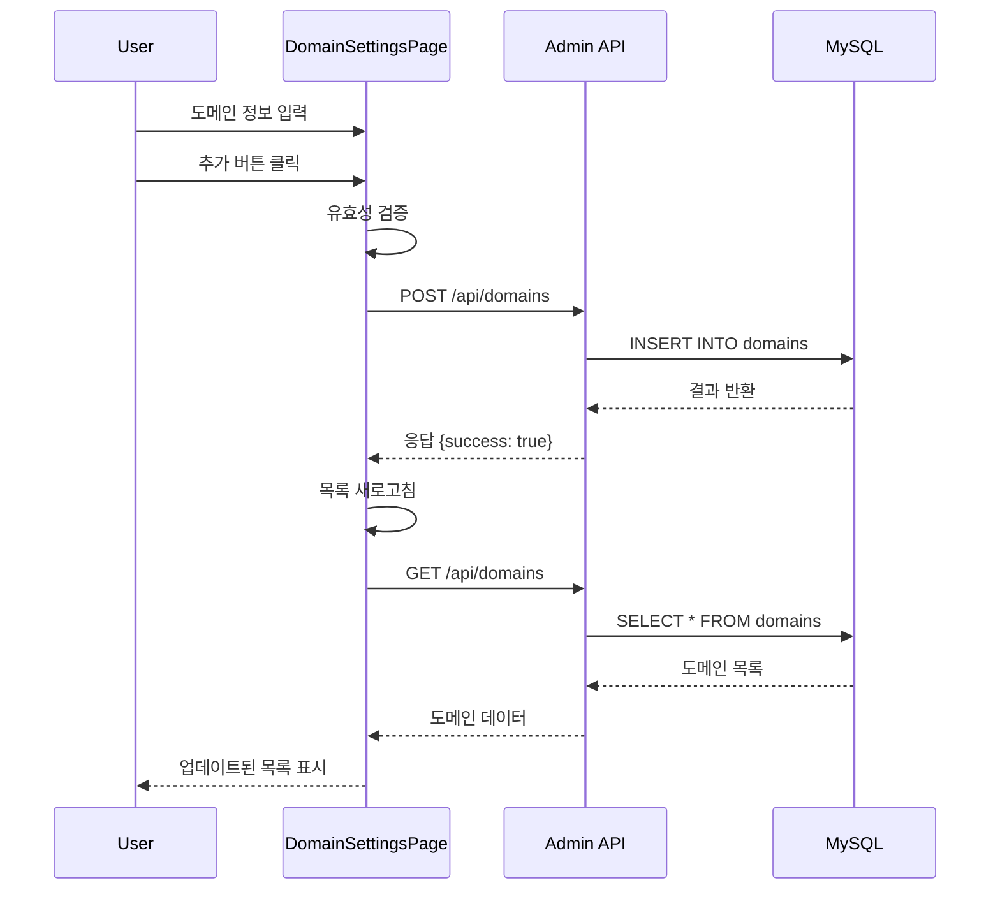
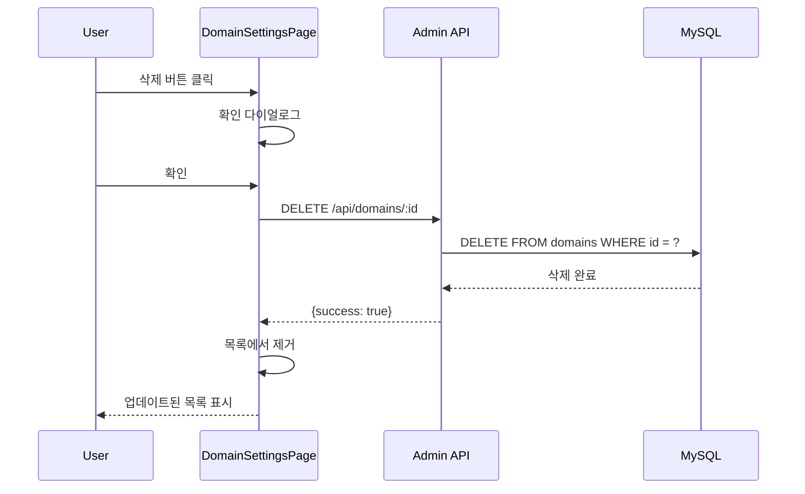
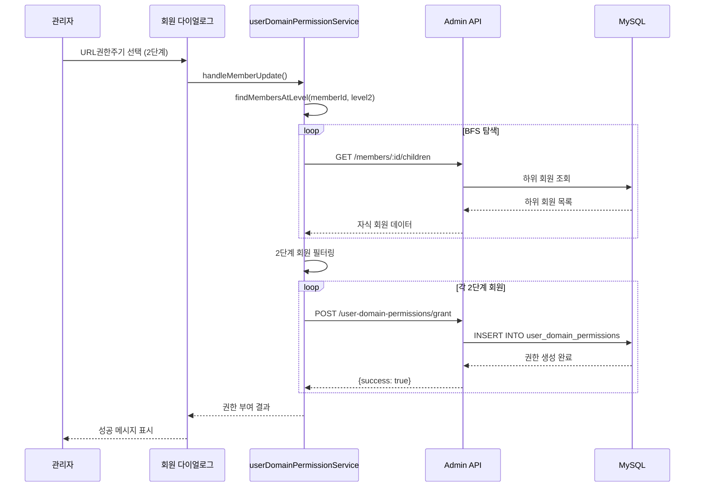
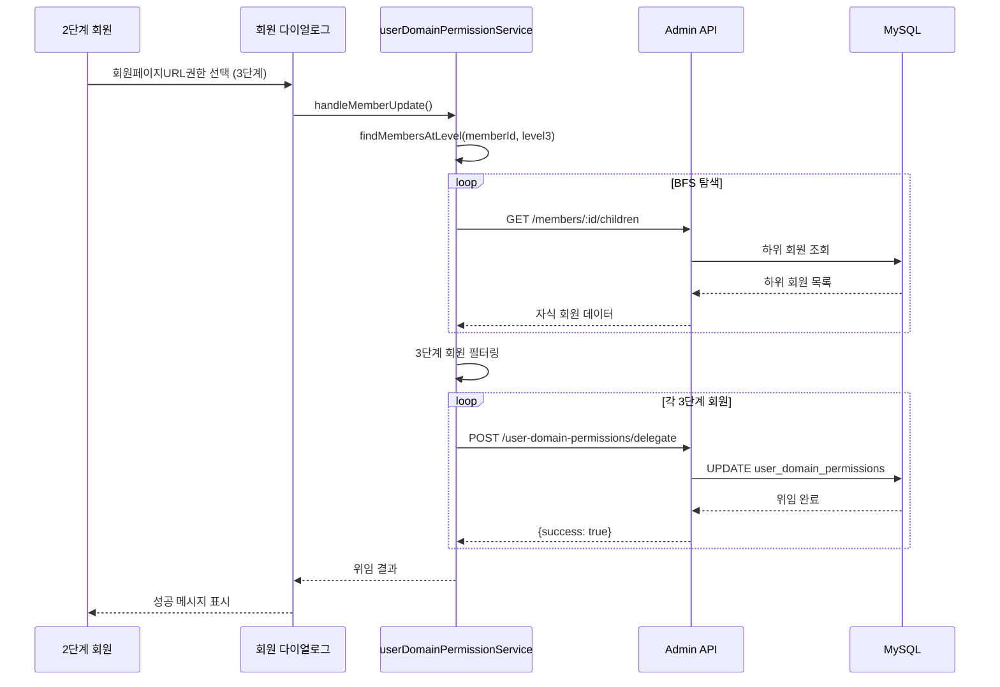
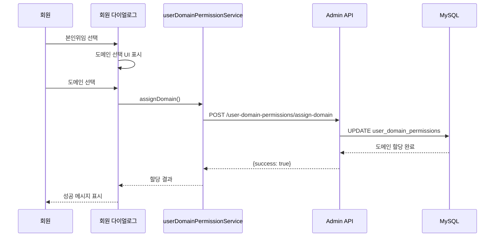
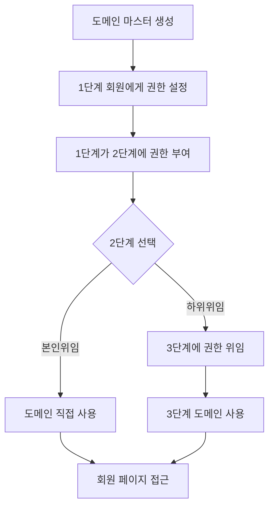
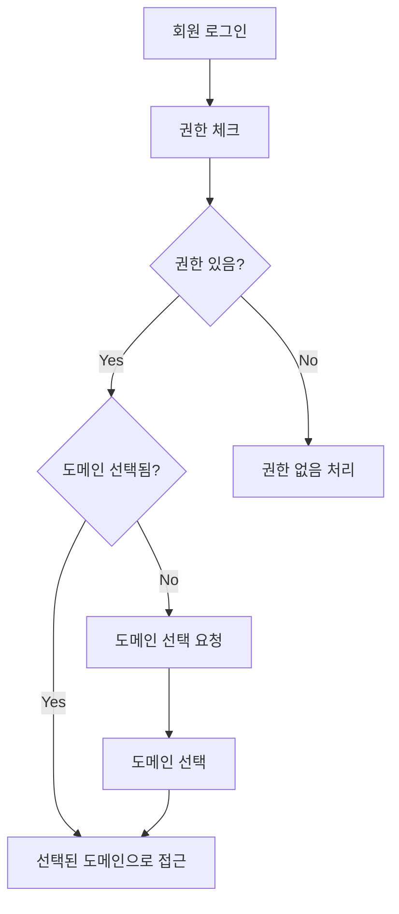

# 도메인 시스템 전체 문서
> NewMoon 프로젝트의 도메인 관련 페이지와 다이얼로그 작동 프로세스 및 정보 내용 상세 문서

## 📋 목차
1. [시스템 개요](#시스템-개요)
2. [도메인 설정 페이지](#도메인-설정-페이지)
3. [회원관리 도메인 권한 시스템](#회원관리-도메인-권한-시스템)
4. [데이터베이스 구조](#데이터베이스-구조)
5. [API 엔드포인트](#api-엔드포인트)
6. [프로세스 플로우](#프로세스-플로우)
7. [사용 시나리오](#사용-시나리오)

---

## 시스템 개요

### 아키텍처
```
┌─────────────────────────────────────────────────────┐
│                   Admin Dashboard                    │
│                  (Port: 5173)                        │
├─────────────────────────────────────────────────────┤
│  ┌──────────────┐        ┌─────────────────────┐   │
│  │ Domain       │        │ Member Management   │   │
│  │ Settings     │        │ Dialog              │   │
│  │ Page         │        │ - URL Permission    │   │
│  └──────────────┘        └─────────────────────┘   │
└─────────────────────────────────────────────────────┘
                           │
                           ▼
┌─────────────────────────────────────────────────────┐
│                   Admin API Server                   │
│                    (Port: 5100)                      │
├─────────────────────────────────────────────────────┤
│  ┌──────────────┐        ┌─────────────────────┐   │
│  │ /domains     │        │ /user-domain-       │   │
│  │              │        │  permissions        │   │
│  └──────────────┘        └─────────────────────┘   │
└─────────────────────────────────────────────────────┘
                           │
                           ▼
┌─────────────────────────────────────────────────────┐
│                    MySQL Database                    │
├─────────────────────────────────────────────────────┤
│  ┌──────────────┐        ┌─────────────────────┐   │
│  │ domains      │        │ user_domain_        │   │
│  │              │        │ permissions         │   │
│  └──────────────┘        └─────────────────────┘   │
└─────────────────────────────────────────────────────┘
```

### 핵심 기능
1. **도메인 마스터 관리**: Admin/User 타입별 도메인 CRUD
2. **3단계 권한 계층**: 1단계→2단계→3단계 권한 부여/위임
3. **자동 권한 관리**: 회원 레벨별 자동 권한 할당

---

## 도메인 설정 페이지

### 위치 및 접근
- **URL**: `http://220.95.232.167:5173/site-settings/domain`
- **경로**: 사이트 설정 > 도메인 설정
- **파일**: `/admin-dashboard-source/src/pages/site-settings/DomainSettingsPage.jsx`

### UI 구성요소

#### 1. 도메인 추가 섹션
```jsx
┌──────────────────────────────────────┐
│         도메인 추가                   │
├──────────────────────────────────────┤
│ 도메인 유형: [Admin ▼] [User ▼]     │
│                                      │
│ 도메인 URL:                          │
│ ┌──────────────────────────────────┐ │
│ │ https://example.com              │ │
│ └──────────────────────────────────┘ │
│                                      │
│ 설명:                                │
│ ┌──────────────────────────────────┐ │
│ │ 관리자 도메인                     │ │
│ └──────────────────────────────────┘ │
│                                      │
│ [➕ 추가]                            │
└──────────────────────────────────────┘
```

#### 2. 도메인 목록 테이블
```jsx
┌────────────────────────────────────────────────────────────┐
│ 유형    │ 도메인 URL              │ 설명      │ 작업      │
├────────────────────────────────────────────────────────────┤
│ Admin   │ https://admin.site.com  │ 관리자용  │ [삭제]    │
│ User    │ https://user.site.com   │ 사용자용  │ [삭제]    │
└────────────────────────────────────────────────────────────┘
```

### 작동 프로세스

#### 도메인 추가 프로세스


#### 도메인 삭제 프로세스


### 코드 구조

#### 상태 관리
```javascript
// DomainSettingsPage.jsx 주요 상태
const [domains, setDomains] = useState([]);
const [newDomain, setNewDomain] = useState({
  url: '',
  type: 'admin',
  description: ''
});
const [loading, setLoading] = useState(false);
const [error, setError] = useState(null);
```

#### API 통신
```javascript
// 도메인 목록 조회
const fetchDomains = async () => {
  try {
    const response = await api.get('/domains');
    if (response.data.success) {
      setDomains(response.data.data);
    }
  } catch (error) {
    console.error('도메인 목록 조회 실패:', error);
  }
};

// 도메인 추가
const handleAddDomain = async () => {
  try {
    const response = await api.post('/domains', newDomain);
    if (response.data.success) {
      await fetchDomains();
      setNewDomain({ url: '', type: 'admin', description: '' });
    }
  } catch (error) {
    setError(error.response?.data?.error);
  }
};
```

### 개선 필요 사항
- **Line 140, 154**: 논리 연산자 오류 수정 필요
  ```javascript
  // 현재 (잘못됨)
  if (!levelError.response?.status === 401)
  
  // 수정 필요
  if (levelError.response?.status !== 401)
  ```

---

## 회원관리 도메인 권한 시스템

### 위치 및 접근
- **페이지**: 회원관리 > 회원 상세보기 다이얼로그
- **탭**: 기본정보 탭
- **파일**: `/admin-dashboard-source/src/components/dialogs/tabs/BasicInfoTabWithUsernameChange.jsx`

### 3단계 권한 계층 구조

```
┌─────────────────────────────────────────────────┐
│                   1단계 (Level 1)                │
│                  권한 부여자                     │
│                 (Grant Authority)                │
└─────────────────────────────────────────────────┘
                         │
                         ▼ 권한 부여 (Grant)
┌─────────────────────────────────────────────────┐
│                   2단계 (Level 2)                │
│                  권한 수령자                     │
│               (Permission Holder)                │
│                 위임 가능 (Can Delegate)         │
└─────────────────────────────────────────────────┘
                         │
                         ▼ 권한 위임 (Delegate)
┌─────────────────────────────────────────────────┐
│                   3단계 (Level 3)                │
│                  최종 사용자                     │
│                 (End User)                       │
│               위임 불가 (Cannot Delegate)        │
└─────────────────────────────────────────────────┘
```

### UI 구성요소

#### 1단계 회원 UI (권한 부여자)
```jsx
┌──────────────────────────────────────────┐
│          사이트 설정                      │
├──────────────────────────────────────────┤
│ URL권한주기:                             │
│ ┌────────────────────────────────────┐  │
│ │ 2단계 회원들 ▼                      │  │
│ └────────────────────────────────────┘  │
│                                          │
│ 설명: 선택한 레벨의 모든 하위 회원에게   │
│      도메인 접근 권한을 부여합니다.      │
└──────────────────────────────────────────┘
```

#### 2단계 회원 UI (권한 보유자/위임 가능)
```jsx
┌──────────────────────────────────────────┐
│          사이트 설정                      │
├──────────────────────────────────────────┤
│ 회원페이지URL권한:                       │
│ ┌────────────────────────────────────┐  │
│ │ 본인위임 ▼                          │  │
│ │ ├─ 본인위임                         │  │
│ │ └─ 3단계 회원들                     │  │
│ └────────────────────────────────────┘  │
│                                          │
│ 본인위임 선택 시:                        │
│ 회원페이지URL선택:                       │
│ ┌────────────────────────────────────┐  │
│ │ https://user.domain.com ▼          │  │
│ └────────────────────────────────────┘  │
└──────────────────────────────────────────┘
```

#### 3단계 회원 UI (최종 사용자)
```jsx
┌──────────────────────────────────────────┐
│          사이트 설정                      │
├──────────────────────────────────────────┤
│ 회원페이지URL선택:                       │
│ ┌────────────────────────────────────┐  │
│ │ https://assigned.domain.com ▼      │  │
│ └────────────────────────────────────┘  │
│                                          │
│ 설명: 할당받은 도메인을 선택하거나       │
│      변경할 수 있습니다.                 │
└──────────────────────────────────────────┘
```

### 권한 처리 프로세스

#### 권한 부여 프로세스 (1단계 → 2단계)


#### 권한 위임 프로세스 (2단계 → 3단계)


#### 도메인 선택 프로세스 (본인위임)


### 핵심 알고리즘

#### BFS 기반 하위 회원 탐색
```javascript
const findMembersAtLevel = async (parentId, targetLevel) => {
  const members = [];
  const queue = [parentId];
  const visited = new Set();
  
  while (queue.length > 0) {
    const currentId = queue.shift();
    if (visited.has(currentId)) continue;
    visited.add(currentId);
    
    try {
      const response = await api.get(`/members/${currentId}/children`);
      if (response.data.success && response.data.data) {
        for (const child of response.data.data) {
          if (child.agent_level_id === targetLevel) {
            members.push(child);
          }
          // 목표 레벨보다 상위면 계속 탐색
          if (child.agent_level_id < targetLevel) {
            queue.push(child.id);
          }
        }
      }
    } catch (error) {
      console.error(`회원 ${currentId}의 하위 조회 실패:`, error);
    }
  }
  
  return members;
};
```

---

## 데이터베이스 구조

### domains 테이블
```sql
CREATE TABLE domains (
    id INT PRIMARY KEY AUTO_INCREMENT,
    url VARCHAR(255) NOT NULL UNIQUE,
    type ENUM('admin', 'user') DEFAULT 'user',
    description TEXT,
    is_active BOOLEAN DEFAULT true,
    created_at TIMESTAMP DEFAULT CURRENT_TIMESTAMP,
    updated_at TIMESTAMP DEFAULT CURRENT_TIMESTAMP ON UPDATE CURRENT_TIMESTAMP
);
```

### user_domain_permissions 테이블
```sql
CREATE TABLE user_domain_permissions (
    id INT PRIMARY KEY AUTO_INCREMENT,
    member_id INT NOT NULL,
    domain_id INT,
    granted_by INT,
    delegated_by INT,
    can_delegate BOOLEAN DEFAULT false,
    delegation_type VARCHAR(50),
    is_active BOOLEAN DEFAULT true,
    created_at TIMESTAMP DEFAULT CURRENT_TIMESTAMP,
    updated_at TIMESTAMP DEFAULT CURRENT_TIMESTAMP ON UPDATE CURRENT_TIMESTAMP,
    
    FOREIGN KEY (member_id) REFERENCES members(id),
    FOREIGN KEY (domain_id) REFERENCES domains(id),
    FOREIGN KEY (granted_by) REFERENCES members(id),
    FOREIGN KEY (delegated_by) REFERENCES members(id),
    
    UNIQUE KEY unique_member_permission (member_id)
);
```

### 권한 체크 뷰 (Recursive CTE)
```sql
WITH RECURSIVE permission_chain AS (
    -- Base case: 직접 권한
    SELECT 
        member_id,
        domain_id,
        granted_by,
        delegated_by,
        can_delegate,
        1 as permission_level
    FROM user_domain_permissions
    WHERE member_id = ? AND is_active = 1
    
    UNION ALL
    
    -- Recursive case: 상위 권한 체인
    SELECT 
        pc.member_id,
        udp.domain_id,
        udp.granted_by,
        udp.delegated_by,
        udp.can_delegate,
        pc.permission_level + 1
    FROM permission_chain pc
    JOIN user_domain_permissions udp ON udp.member_id = pc.granted_by
    WHERE udp.is_active = 1
)
SELECT * FROM permission_chain
ORDER BY permission_level;
```

---

## API 엔드포인트

### 도메인 관리 API

| Method | Endpoint | 설명 | Request Body | Response |
|--------|----------|------|--------------|----------|
| GET | `/api/domains` | 도메인 목록 조회 | - | `{success: true, data: Domain[]}` |
| POST | `/api/domains` | 도메인 추가 | `{url, type, description}` | `{success: true, data: Domain}` |
| PUT | `/api/domains/:id` | 도메인 수정 | `{url, type, description}` | `{success: true, data: Domain}` |
| DELETE | `/api/domains/:id` | 도메인 삭제 | - | `{success: true}` |

### 도메인 권한 관리 API

| Method | Endpoint | 설명 | Request Body | Response |
|--------|----------|------|--------------|----------|
| GET | `/api/user-domain-permissions/member/:id` | 회원 권한 조회 | - | `{success: true, data: Permission}` |
| POST | `/api/user-domain-permissions/grant` | 권한 부여 | `{member_id, granted_by, can_delegate}` | `{success: true, message}` |
| POST | `/api/user-domain-permissions/delegate` | 권한 위임 | `{member_id, delegated_by, delegation_type}` | `{success: true, message}` |
| POST | `/api/user-domain-permissions/assign-domain` | 도메인 할당 | `{member_id, domain_id}` | `{success: true, message}` |
| DELETE | `/api/user-domain-permissions/revoke/:id` | 권한 회수 | `{revoked_by}` | `{success: true}` |

---

## 프로세스 플로우

### 전체 시스템 플로우


### 권한 검증 플로우


---

## 사용 시나리오

### 시나리오 1: 초기 설정
1. **관리자가 도메인 마스터 생성**
   - Admin 도메인: `https://admin.newmoon.com`
   - User 도메인: `https://user1.newmoon.com`, `https://user2.newmoon.com`

2. **1단계 회원(총판)에게 권한 부여**
   - 회원관리에서 1단계 회원 선택
   - URL권한주기에서 "2단계" 선택
   - 저장하면 모든 2단계 하위 회원에게 권한 자동 부여

3. **2단계 회원(부본)의 선택**
   - 옵션 1: 본인위임 → 직접 도메인 선택하여 사용
   - 옵션 2: 3단계 위임 → 하위 회원들이 사용하도록 위임

4. **3단계 회원(매장)의 도메인 사용**
   - 할당받은 도메인 목록에서 선택
   - 선택한 도메인으로 회원 페이지 접근

### 시나리오 2: 권한 변경
1. **권한 회수**
   - 1단계 회원이 2단계 권한 회수
   - 연쇄적으로 3단계 권한도 자동 회수

2. **권한 재부여**
   - 새로운 2단계 회원에게 권한 부여
   - 해당 라인의 3단계 회원도 자동으로 권한 받음

### 시나리오 3: 도메인 관리
1. **도메인 추가**
   - 새로운 User 도메인 추가
   - 기존 권한 구조에 자동 반영

2. **도메인 삭제**
   - 사용 중인 도메인 확인
   - 대체 도메인 지정 후 삭제

---

## 트러블슈팅 가이드

### 일반적인 문제와 해결방법

#### 1. 권한이 표시되지 않음
- **원인**: 회원 레벨 설정 오류
- **해결**: 
  ```sql
  -- 회원 레벨 확인
  SELECT id, username, agent_level_id FROM members WHERE id = ?;
  -- 권한 상태 확인
  SELECT * FROM user_domain_permissions WHERE member_id = ?;
  ```

#### 2. 도메인 선택 불가
- **원인**: 도메인 비활성화 또는 권한 없음
- **해결**:
  ```sql
  -- 활성 도메인 확인
  SELECT * FROM domains WHERE is_active = 1;
  -- 권한 체인 확인
  SELECT * FROM user_domain_permissions 
  WHERE member_id = ? OR granted_by = ? OR delegated_by = ?;
  ```

#### 3. BFS 탐색 무한 루프
- **원인**: 순환 참조 또는 visited 체크 누락
- **해결**: visited Set 사용 확인, 순환 참조 검사

### 성능 최적화 팁

1. **인덱스 추가**
   ```sql
   CREATE INDEX idx_member_level ON members(agent_level_id);
   CREATE INDEX idx_permission_member ON user_domain_permissions(member_id);
   CREATE INDEX idx_permission_granted ON user_domain_permissions(granted_by);
   ```

2. **캐싱 전략**
   - 도메인 목록 캐싱 (5분)
   - 권한 정보 캐싱 (세션 단위)

3. **배치 처리**
   - 다수 회원 권한 부여 시 트랜잭션 사용
   - Promise.all()로 병렬 처리

---

## 보안 고려사항

### 권한 검증
1. **백엔드 검증 필수**
   - 모든 API 호출 시 JWT 토큰 검증
   - 회원 레벨별 접근 권한 체크

2. **도메인 화이트리스트**
   - 등록된 도메인만 허용
   - CORS 설정과 연동

3. **감사 로그**
   - 모든 권한 변경 이력 기록
   - 도메인 접근 로그 저장

### SQL Injection 방지
```javascript
// 안전한 쿼리 사용
const query = 'SELECT * FROM members WHERE id = ?';
const values = [memberId];
// Prepared statement 사용
```

---

## 향후 개선 제안

1. **UI/UX 개선**
   - 권한 시각화 트리 뷰
   - 드래그앤드롭 권한 할당
   - 실시간 권한 상태 표시

2. **기능 확장**
   - 권한 템플릿 기능
   - 일괄 권한 관리
   - 권한 만료 기능

3. **성능 최적화**
   - GraphQL 도입 검토
   - Redis 캐싱 레이어
   - 웹소켓 실시간 업데이트

4. **모니터링**
   - 권한 사용 통계
   - 도메인별 접속 현황
   - 이상 접근 감지

---

## 결론

NewMoon 프로젝트의 도메인 시스템은 3단계 계층 구조를 통해 체계적인 권한 관리를 구현했습니다. 
- **도메인 설정 페이지**: 95% 완성 (일부 예외처리 개선 필요)
- **URL 권한 시스템**: 100% 구현 완료
- **백엔드 API**: 모든 엔드포인트 구현 완료
- **데이터베이스**: 최적화된 스키마 설계

시스템은 프로덕션 사용 가능한 상태이며, 제안된 개선사항을 통해 더욱 강력하고 사용하기 쉬운 시스템으로 발전할 수 있습니다.

---

*문서 작성일: 2025년 1월 19일*
*작성자: NewMoon 개발팀*
*버전: 1.0.0*